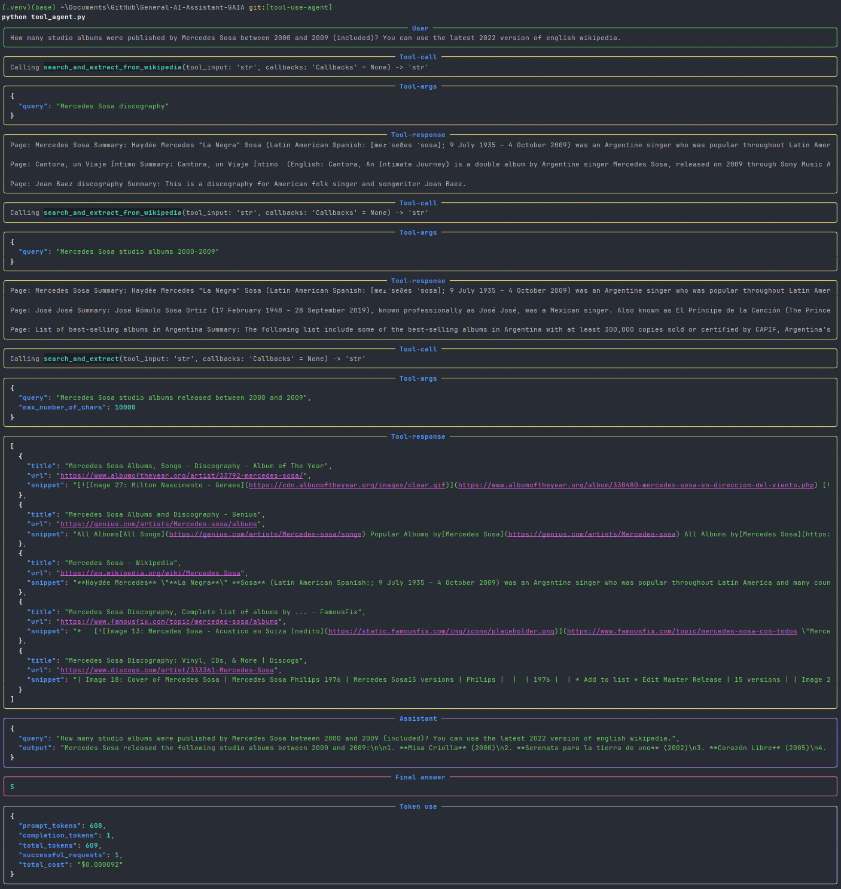
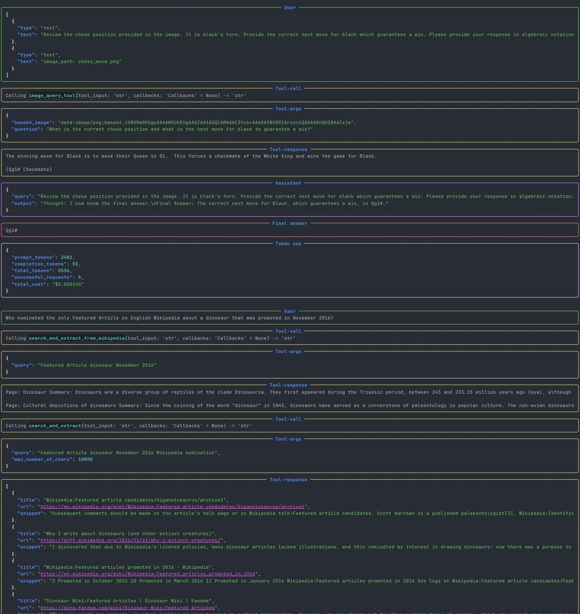

# General-AI-Assistant-GAIA

GAIA is a general AI assistant that can help you with a wide range of tasks, from answering questions to writing code. It is designed to be easy to use and accessible to everyone.
It is built using the tool-use pattern, which allows it to use external tools to perform tasks that are beyond its capabilities.

Here is an example of the interaction with GAIA:

Screenshots:

