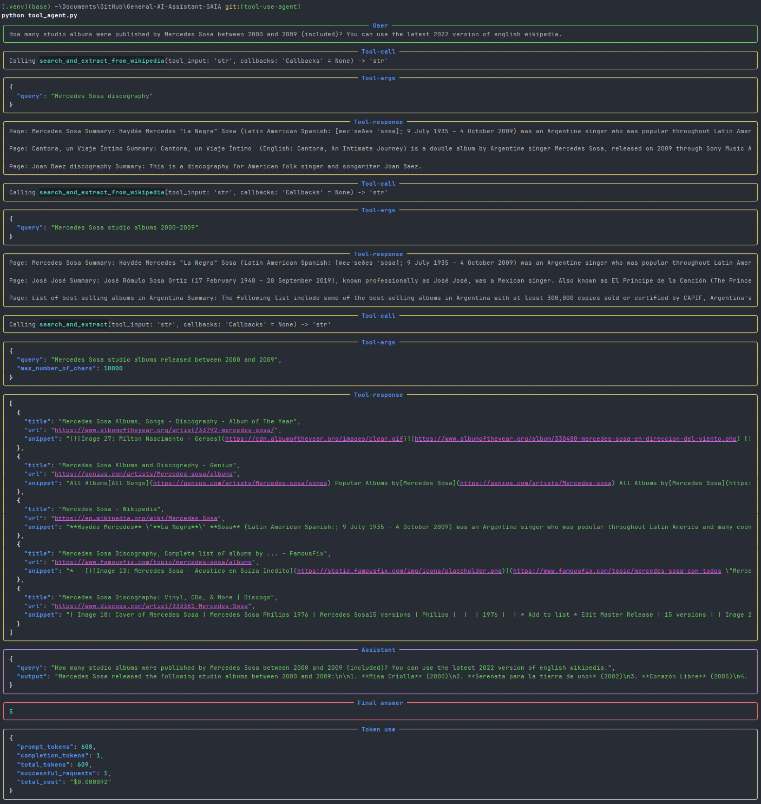
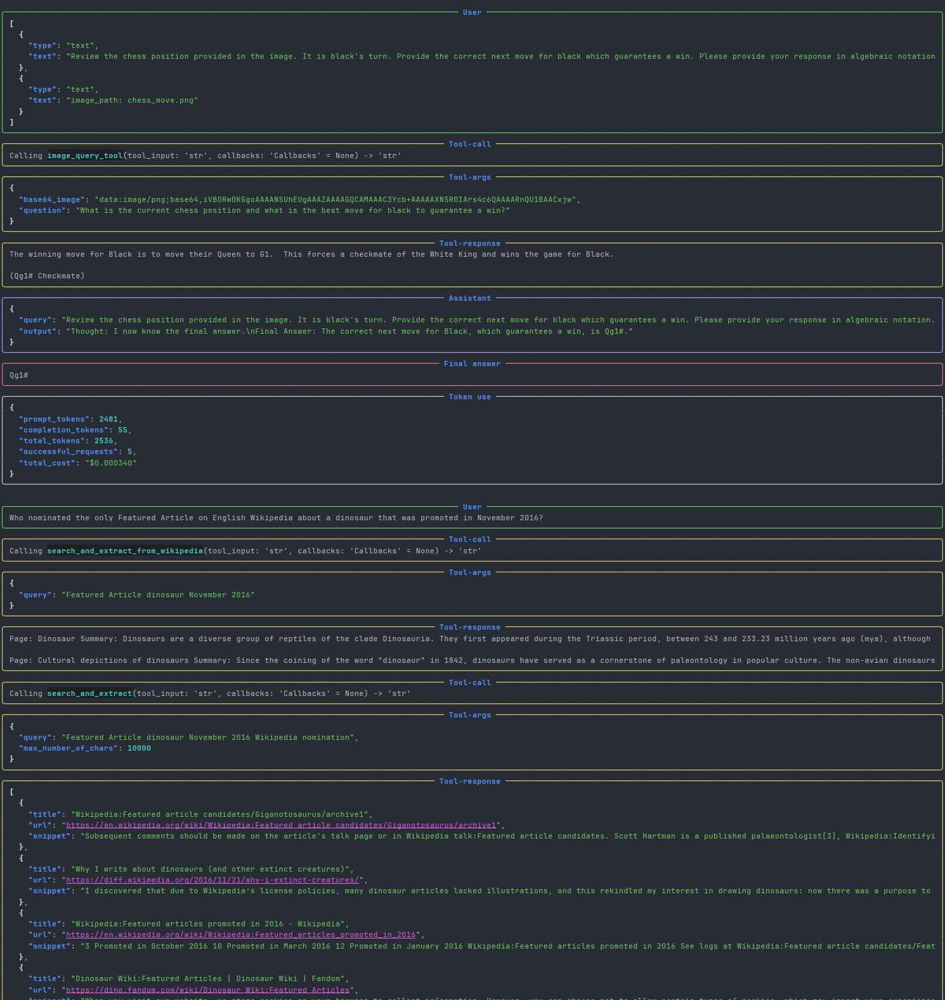
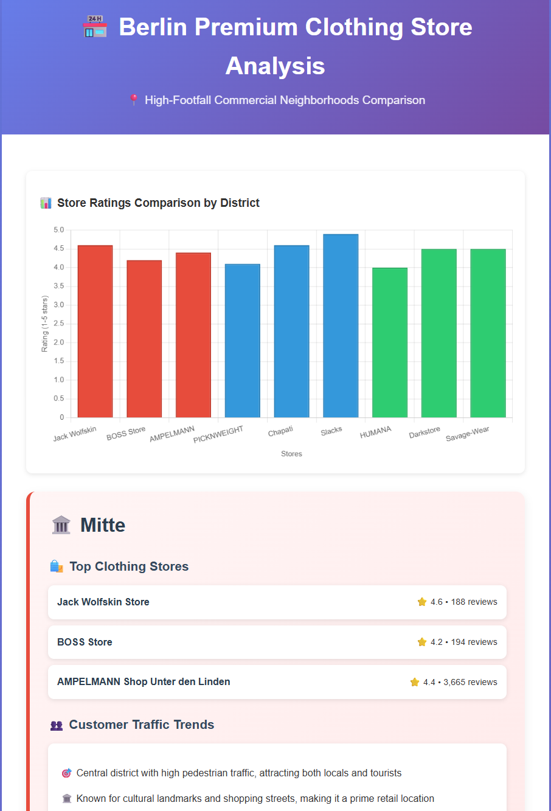
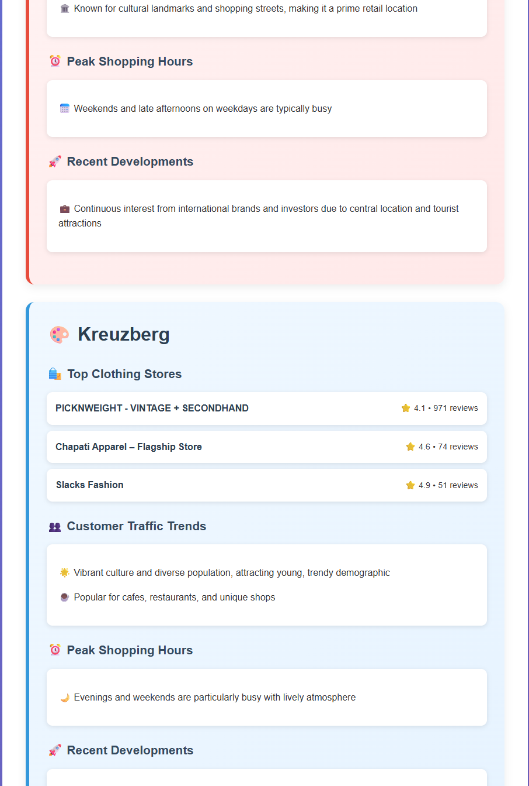
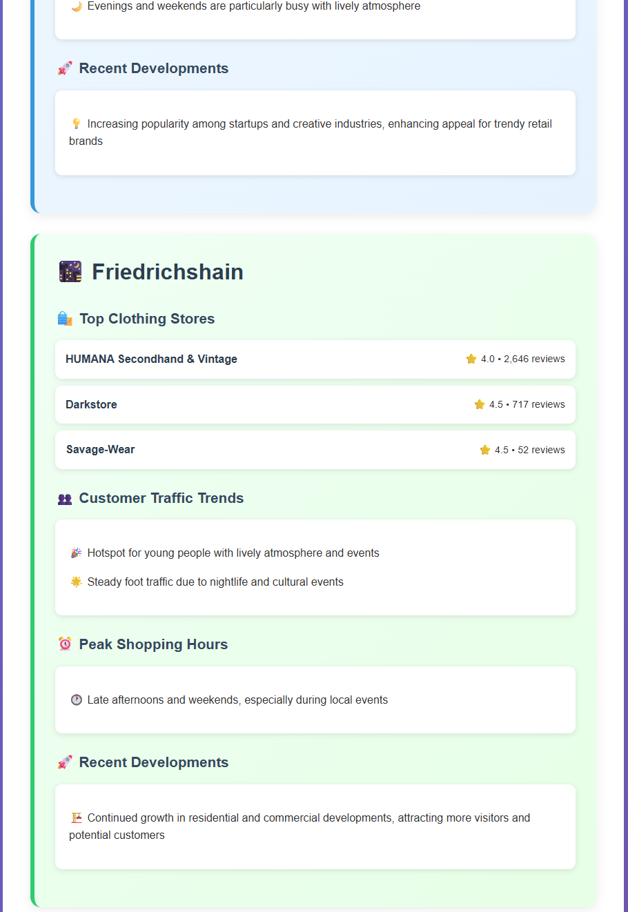
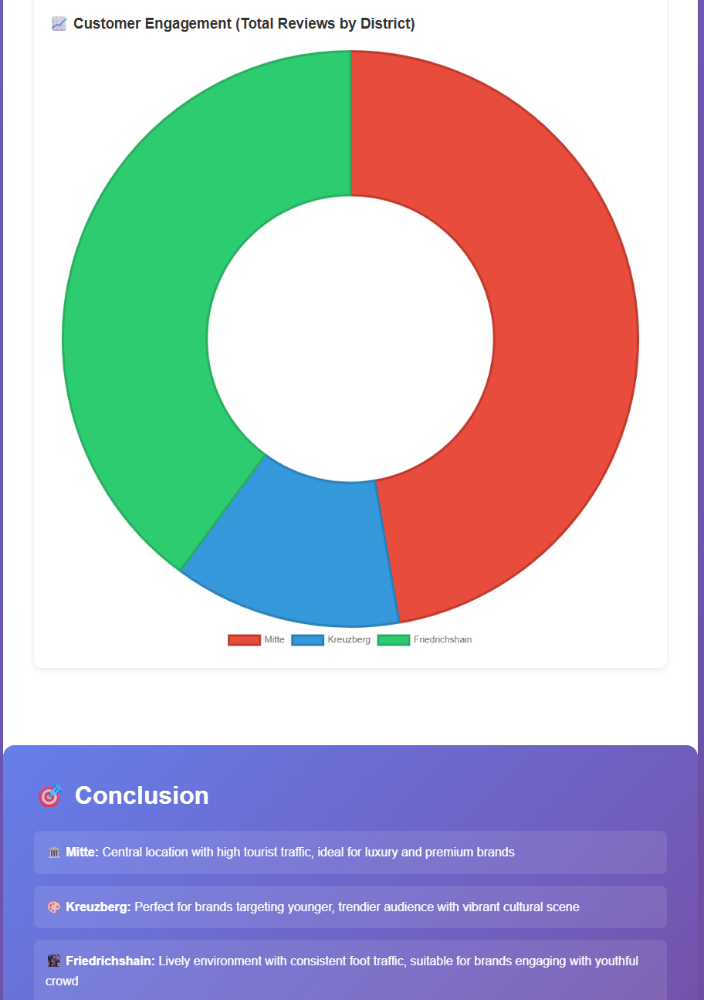
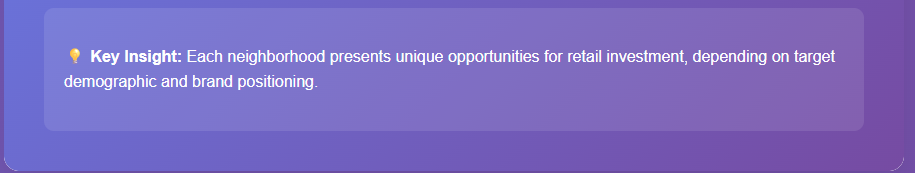

# General-AI-Assistant-GAIA

GAIA is a general AI assistant that can help you with a wide range of tasks, from answering questions to writing code. It is designed to be easy to use and accessible to everyone.
It is built using the tool-use pattern, which allows it to use external tools to perform tasks that are beyond its capabilities.

Here is an example of the interaction with GAIA:

Screenshots:

### Research Assistant: Clothing Stores Expansion Location Analysis

Langgraph ReAct Agent is used to analyze the best location for expanding clothing stores. It uses a combination of tools to gather data, analyze it, and provide recommendations in a final report.

[🔗 View Interactive Berlin Store Analysis](https://claude.ai/public/artifacts/85f455e7-ebf8-451e-a1ac-8d0a53c8145c)

